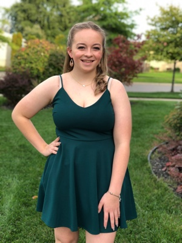

Dear Sensei Yaquinto,
  
For over six years we’ve been fortunate to sit alongside the mats and watch Brooklynn not only learn the art of karate, but find herself along the way. From the moment she first hit the mats she loved it. The strength she was gaining, continuous learning opportunities and positive community started a fire within her to learn and do more. 
  
Along her journey to Level 2 Junior Black Belt we’ve watched her be pushed physically and mentally, further than she thought possible. She has been pushed to the point of tears and stood back up. Face adversities at her former dojo and continued to stay true to herself and not give up on the art she had grown to love. 
  
Being part of Zen Bei Butoku-Kai Brooklynn has had opportunities to be a student instructor. It spoke to a passion of hers that I’m not sure she knew existed. There is something special about her that wants to teach and see others be successful. No matter the obstacles they face, she wants to stand next to them and help them also learn the art she loves. 
  
There are no words to describe the feelings we had when a parent of a student Brooklynn was teaching would come up to during class to thank me. To tell me how amazing she was with their son or daughter. How much she helped them. 
  
Trophies, belt ranks… none of it mattered to me as her parent. It was clear to me this is where Brooklynn needed to be. To embrace her passion of teaching, learning, guiding and helping others. 
  
Now today, on her sixteenth birthday, we get to the opportunity to write this letter to you to recommend her for belt promotion. To take time to document how proud I am of her and all she has accomplished is something I am forever thankful for. Days, weeks, months, years are gone in the blink of an eye. In the race through each day we forget to pause to focus on all the blessings around us. 
  
Brooklynn is an incredible young woman that we are profoundly proud to call our daughter. She is stronger than she realizes. She has the ability to accomplish more than she will ever know. Her years learning karate have helped her see a shimmer of that and I can’t wait to see all she will achieve. 
  
Thank you for creating an environment and community at your dojo that continues to be an inspiration and positive influence on Brookynn’s life!
  

Sincerely, 

Sara Gibbons
   

  
  
  

