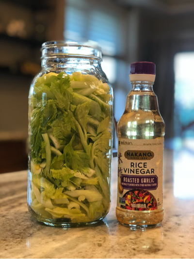

### Fitness Week

There is something about feeling strong. Going through the difficult workout, the soreness eventually passes and then that feeling of "LET'S GO AGAIN!" hits. It's a reminder that I can do difficult things. Between that and Scott stopping me mid-sentence last week to say, "do you realize you clearly have muscle definition in your arms as you stand there?" I'm not gonna lie, I took a moment to flex it out. Then, it was on! 🏋️‍♀️ 💪
  

My goal this week quickly turned into keep walking + reading (I just love that time during the summer months), and get to the finish line of the <a href="https://www.chloeting.com/program/2020/summer-shred-challenge.html" target="_blank" rel="noopener">Chloe Ting Summer 2020 Shred Challenge</a>. Here is what my week looked like...
  
<ul>
<li> Besides the morning it rained, each morning, laced up, hit the pavement and cranked out about 3 miles with some 80s music and Audible book</li>
<li> Workin' it out with my girl Chloe, days 24, 25, 26 and 27: <a href="https://www.chloeting.com/program/2020/summer-shred-challenge.html" target="_blank" rel="noopener">Chloe Ting Summer 2020 Shred Challenge</a>. Saved the last day for the weekend, it seemed like a lot and to be honest, to fully complete the challenge I need to add on the <a href="https://www.youtube.com/watch?v=5qCjyzbKmAE&feature=youtu.be" target="_blank" rel="noopener">Lean Arms Workout Challenge</a> from day 26 that I stopped in the middle after saying aloud, "You are out of your mind with all the up downs lady?! Hell to the no! We're done today!"</li>
</ul>

 
 

### Currently Reading

<a href="https://www.radicalcandor.com/" target="_blank">**"Radical Candor" by Kim Scott**</a> Realizing more and more how important the people aspect is to my professional life. Mentoring, building teams, comradery, laughing, kindness, teaching, jokes... I love all of it! I truly believe anything of measure of success comes from a great team. This book definitely brings more of that spirit to surface for me. The players on needed on a team, leadership, building those qualities on a team. I'm about a third through it so far, enjoying all it is feeding me.
 
 
 

### Podcasts

<a href="https://jenhatmaker.com/podcast/series-26/elizabeth-gilbert-moves-from-fear-to-fierce/" target="_blank" rel="noopener">**"Series: 26: For The Love of Being Fierce Free and Full of Fire | Epidode 07" - Jen Hatmaker w/ Elizabeth Gilbert**</a> I first heard Jen Hatmaker speak on <a href="https://thehollisco.com/pages/rise-live" target="_blank" rel="noopener">Rachel Hollis's RISE Live event</a> back in May. I can't remember what it was that made her come to mind again, but I remembered she had a podcast. I randomly picked this one not knowing much of Elizabeth Gilbert... it was a good find! She had some deep thoughts on getting to the inner you, taking care of yourself. Reflecting. Not sure I was ready for that level of deep but definitely glad I found it and gave it a listen.
  
<a href="https://jayshetty.me/podcast/glennon-doyle-on-how-to-stop-asking-for-permission-listening-to-other-peoples-opinions/" target="_blank" rel="noopener">**"How To Stop Asking for Permission & Listening to Other People's Opinions" - Jay Shetty w/ Glennon Doyle**</a> Listen, y'all know I LOVE Glennon's "Untamed". I'm a fan of Jay's, and when I saw this come up as a recommendation I was all in! It was an amazing discussion very much in the spirit of Untamed. She digs into parenting being a role model, and just all around great stuff. This is for sure on my listen to again list.
 
 
 

### Eats

**Pickled Celery** 

Yeah so I've gotten pretty into pickling veggies. After we all fought over the celery in my last batch I devoted a whole jar to just celery. Even found a new vinegar to use with it, Rice Wine Roasted Garlic vinegar. Did less sugar and less salt this go round too.  Verdict: Delicious! I boiled the vinegar + water with some peppercorns and mustard seeds. Could taste them both (and the garlic) in the celery. Next time, a bit more sugar and salt. Family consensus though was batch of veggies in apple cider vinegar + honey is the one to make again.

 
 

### Grateful For...

1. Hunter making lunch for the boys all on his own. Scott is partly back to the office, I'm in my home office plugged in cranking out code and Hunter a few times this week decided he was making lunch. I emerged from my hole and found him making biscuit pizzas and Kool-Aid. Boys loved it. So cool to see Hunter get more and more into baking and cooking.

2. The shout-outs from 2 people on the client project I'm currently working on. I don't feel like I did much special besides tell them, "Oh we're in this together, let's go!" And kept us working closely to get some big items completed. Was nice to know how much they appreciated it.

3. Hearing from a great friend out of the blue, just to say hi. I absolutely have to make that happen more.
    
    
    
