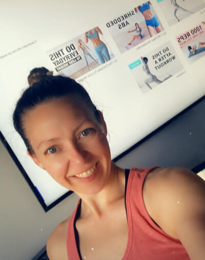
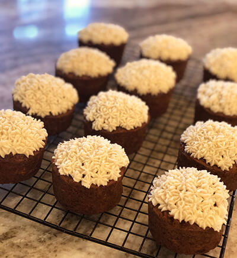
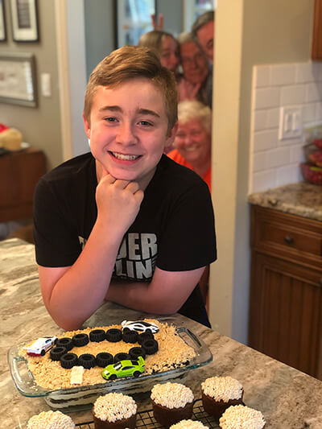
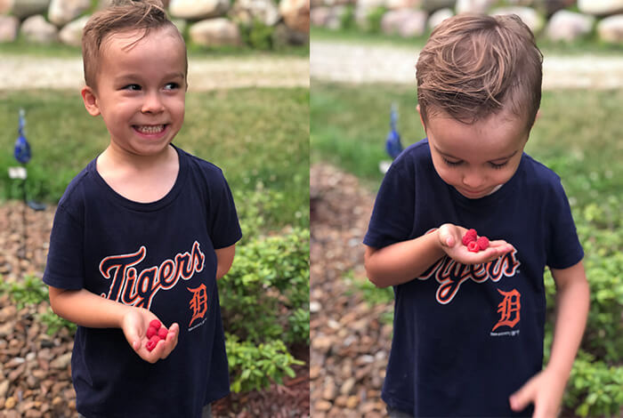

### Fitness Week

I did it! I finished my last workout of the <a href="https://www.chloeting.com/program/2020/summer-shred-challenge.html" target="_blank" rel="noopener">Chloe Ting Summer 2020 Shred Challenge</a>! 🤸‍♀️ Adding in the warm up and the <a href="https://www.youtube.com/watch?v=5qCjyzbKmAE&feature=youtu.be" target="_blank" rel="noopener">Lean Arms Workout Challenge</a> I said "oh hell no!" to the week before it was 1.25 hours of moving, sweating and pushing myself keep going.
 
 
I realize now if I have to figure out how to workout, no way. Too overwhelming. I can walk or need someone to spoon feed me what to do. It's clear Instagram and Google have known this about me and have been serving me ads for weeks. Fine, I hear you... I will try one of the things, but it's a hard pass on clicking on the ad thank you. Not failing into that trip.  Here is what I tried this week:
 
 

<a href="https://www.youtube.com/watch?v=31BiQiXk8jQ" target="_blank" rel="noopener">**DAY 1 Home Workout Challenge // Total Body HIIT (No Equipment)**</a> I sweat my ass off through this whole workout. Each exercise was 40 seconds, which you think doesn't sound like a lot until you are only 20 seconds in and questioning your life choices. Based on the jumping exercises this one comes with a moderate pee factor, so all you mamas out there be ready to mix in the modifications. 
 
 
<a href="https://www.youtube.com/watch?v=azF7RsPXB2k" target="_blank" rel="noopener">**Heater Robertson: Week 1 Day 1 // Full Body Workout - No Equipment**</a> I liked this routine a lot. Each exercise was 30 seconds, so totally my speed. Less jumping, win. Got sweaty and a good workout in. Not gonna lie, 12 weeks is an intimidating commitment on this one... I mean I'm a person who doesn't even have dinner planned for tonight. 12 weeks, phew, maybe.
 
Overall liked Heather's workouts. I only wish I knew how far along I was in the set and workout overall. She also doesn't talk, you only hear a bell ring. My girl Chloe is a talker, kinda like that. 
 
 
 

### Reading
#### Finished 
<a href="https://www.goodreads.com/book/show/749937.The_Three_Signs_of_a_Miserable_Job" target="_blank" rel="noopener">**"The Three Signs of a Miserable Job" by Patrick Lencioni**</a> Patrick's books are interesting to me cause I like they way he tells a story to make his point and then dives into action items and take aways. This one was good, but maybe don't listen to on Audible. The narrator does these voices... I mean I appreciate the effort, but this guy talking for the Mexican character, cowboy and 4 others... just no. Beyond that, great points to think about as a leader to keep your team engaged and thriving. 
  

#### Currently Reading
<a href="https://www.radicalcandor.com/" target="_blank" rel="noopener">**"Radical Candor" by Kim Scott**</a> It seems like I'm about a third through this one. I really like the chapter I just finished on team collaboration. How as a leader, telling people what to do will destroy a team. The need to pull your team together, give the space and listen to their thoughts and ideas. And how those ideas often result in some of the best ones when people feel they can be open and work together. It's great stuff and continues to reinforce + expand on my views on leadership. 
 
 
 

### Podcasts
<a href="https://open.spotify.com/episode/3Qgfq8cLlUWKnkcRfTh3mB?si=-8qzGcD1Twabdh-kV6EaAA" target="_blank" rel="noopener">**"RISE Podcast #154: If You Can't Giggle At Yourself Five Years From Now, You Haven't Grown Enough" - Rachel Hollis w/ Brit Barron**</a> I love me some Rachel Hollis, and always appreciate her honesty, vulnerability and that she seems to say what we are all thinking by don't always let it out. I got introduced to Brit Barron through <a href="https://thehollisco.com/pages/rise-live" target="_blank" rel="noopener">RISE Live</a> back in May, and have been following her since. This podcast is definitely worth a listen. How they discuss how we each need to continue to evolve through our entire life was spot on for me. 
 
 
 

### Eats
**Vegan Carrot Cake** 

Carrot cake (minus all signs of raisins) is one of my faves! I found this vegan recipe years ago and it is still top of my list. I always make it as cupcakes, and actually now that I think about it, I only made the frosting in the recipe once. I opt for buttercream frosting using soy-free Earth Balance butter. Here is the link to the original recipe: <a href="https://www.loveandlemons.com/vegan-carrot-cake/" target="_blank" rel="noopener">Love & Lemons: Vegan Carrot Cake</a>

 
 

### Celebrate

Hunter turned 13! 13?! Honestly, I don't know how time has flown by so fast. I don't know how it seems like he's grown a foot while in quarantine. Seriously, I know I professed my love for Kool-Aid and that I wasn't going to read the label, but I am now questioning what grow powder is included in those tiny packets.
  
We enjoyed Hunter's special day with all his faves, topped off with dirt cake (birthday tradition), carrot cupcakes (cause I'm mom and I can) and some family shenanigans. Good day. 🥳

 
 

### Grateful For...
1. Saw horses. And getting another set of them. The are amazing creations that help make all my projects possible. Esp all the wood I am in the middle of staining and sealing for our porch. They are magical and I love them. 

2. <a href="https://www.tiktok.com/@sheena.melwani?lang=en" target="_blank" rel="noopener">@sheena.melwani's Tik Tok</a> and her hilarious father. Tears rolling down my face I was laughing so hard. It is my most favorite internets find.

3. My lil berry lovin Bugs-a-boos. Picking berries and Grandma and Grandpa's was just magical. I'm grateful for every second of that smile and bay like belly laugh he still has when he gets so happy. 🥰

 
 
 
