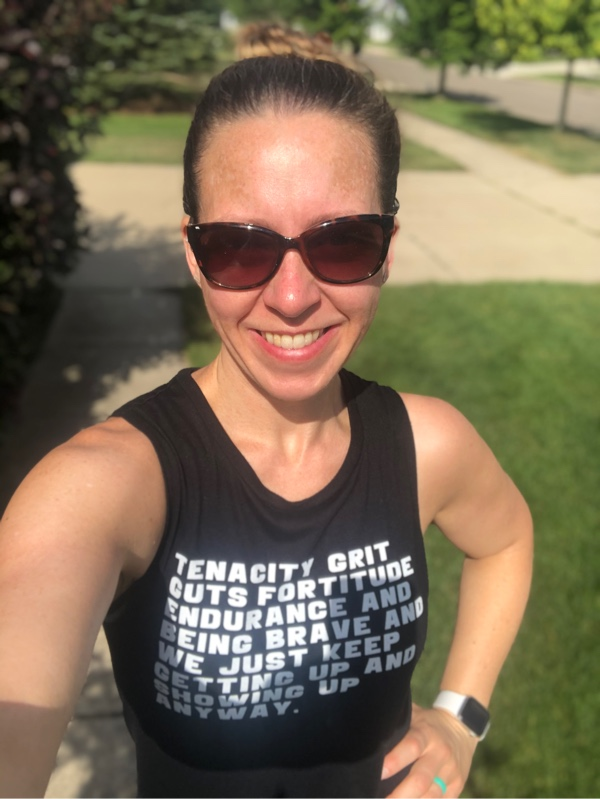
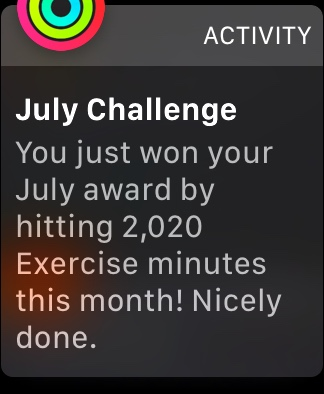
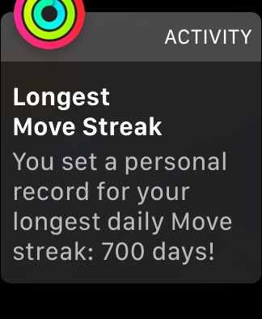
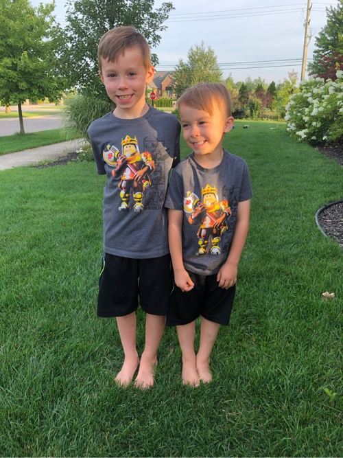

### Fitness Week

Y'all, I made it happen... I hit my Apple Activity goal of 2,020 minutes of exercise for July!! Not only that, but I completed it on the last day of the month which was also day #700 of my move streak! What started as a small goal, a small adjustment to my day... can I fill my move goal today... and next day... next day. Here I am 700 days later, 50lbs lighter, feeling fantastic and all my goals, aspirations are achievable.
  All from one small ripple to my day. Consistency. Not giving up. One small habit.
  

  
  
  

 
 
 

### Reading

#### Currently Reading

<a href="https://www.radicalcandor.com/" target="_blank" rel="noopener">**"Radical Candor" by Kim Scott**</a> I continue to be in to this book. I didn't get too many pages behind me this week as I needed me some Brene. Makes me think more about what I want to to, hwo I want to be present, build teams, all that stuff I love.
  
<a href="https://www.amazon.com/Daring-Greatly-Courage-Vulnerable-Transforms/dp/1592408419" target="_blank" rel="noopener">**"Daring Greatly" by Brene Brown**</a> Brene is just great. I have been slowly bouncing around through all her books. I happened to notice on Audible I hadn't finished "Daring Greatly" yet and quickly started it back it. How she describes shame, vulnerability, leadership, courage, putting on armor it is amazing stuff all should absorb. I especially love how Brene continues to add value to her books with printables and take aways. Even when I listen to the audio book I will always print and take notes. The practice of pen to paper on all the thoughts and ideas I get just makes them stick more.
 
 
 

### Podcasts

<a href="https://www.youtube.com/watch?v=Pbxm3HYnOYo" target="_blank" rel="noopener">**"RISE Podcast #155: Rob Lowe Stops By to Literally Talk About All The Things" - Rachel Hollis w/ Rob Lowe**</a> I wasn't sure what to expect from this one, but it was good! They had a great conversation, brought up great points about life, business, family.
 
 
 

### Unexpected Life

I don't have a 10 year plan. I don't have a 5 year plan. Early in my career I thought that was what I needed to do. I would go on a job interview and get asked what mine was, others I knew had these plans, I had no idea. But since I felt I had to at least have an answer I put some thought to it. It never felt right... I mean I work in technology, something new is coming out every day. How can I know what the tech landscape will look like in 5 years, 1 year... 6 months? How will I know what new opportunities will be open with theose new technologies?
 
 
So I embraced the unknown. Follow my curiosities. Announce I don't have a "x year plan" because if I did it would have kept me from all the awesome I am now doing and have been a part of. The 5 year plan I would have created for myself 5 years ago would have never matched the amazing point I am at today.
 
 
This week I got hit with an unexpected opportunity. One I never would have put on any plan. I'm feeling extremely blessed. For where I am, where I have been and new opportunities. Looking back at my career makes me thankfully I never built any plans.
 
 
 

### Grateful For...

1. My in-laws. We are deep in house projects... I knew when we replaced the 1 window scope creep would spiral out of control. I'm grateful my in-laws know exactly when to stop over to help wrangle some of the house project chaos.

2. Having the opportunity to write college recommendation letters for my Girls Who Code. Great kids with greatness a head of them. I'm grateful to have the chance to shine light of some of the greatness they don't see they have.

3. Confession: While the boys still let me, I dress them samesies whenever I can. I mean first of all they are so damn cute. Best buds that do near everything together. Grateful for those smiles, the excitement they get when they see their matching outfits. 🥰
   

    
    
    
