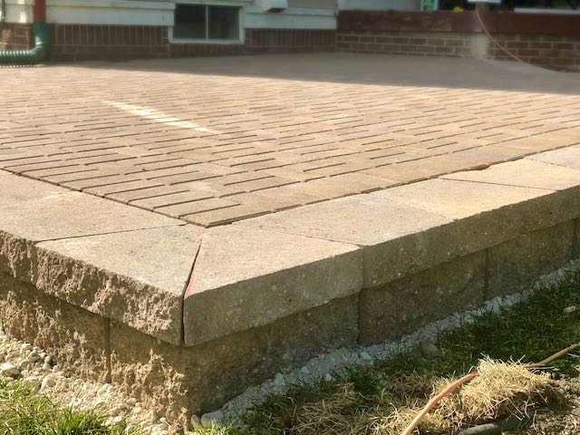
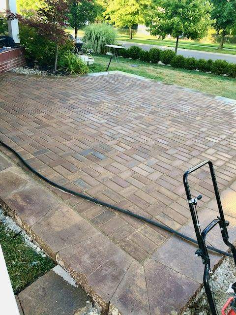
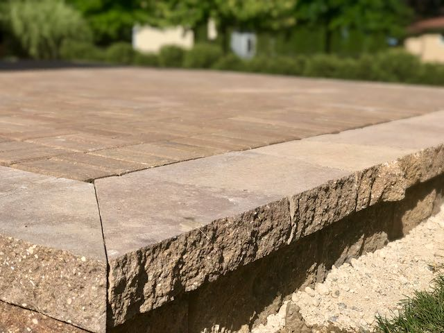

### OMG OMG We Built A Patio!

Y'all, we did it! We faked our way through building a brick paver patio. We've talked about this and been in negotiations over this for years and now we made it a real thing! I still can't feel all of my fingers but we did it! 
 
 
I'd like to thank Google, YouTube, all you DIY-ers who do much better jobs of tracking and posting how you do your projects. Thank you to all the neighbors we chatted with who offered support, encouragement, wine. And most of all, none of this would have been possible without Ibuprofen and Icy Hot. You two create a magical combination that makes all seem possible again. Or was that the hard cider... no matter, you both are great and I an proud to own you in Costco size portions.
 
 
To put to rest the questions I continue to get... 
1. No. No again. Not a chance. I will get into contract patio installation. My pace is squarely behind a keyboard. We all know our role. 
2. Nope, we have never brick paved anything before. We had no idea what we were doing, but we went for it. Cause that is how you learn. Plus, we're not saving babies here as long as it can hold a grill and table, we're good. 
   
 

  
  
  

 
 
 

### Fillin Those Rings + 💪

I still can't decide if I want to hit my August 2020 Apple Activity goal of burning 35,700 calories. All I can see is the finish line to all these home projects, oh and we are going to get there. So I continue to hit the average I need on the calories burned per day for future Sara to figure out. Which doesn't seem to be an problem cause you all know I love me some walk time with Audible!
 
 
Along with the calorie burn you all know I've been in full on "I gotta get me Michelle Obama arms" mode. Progress is slow and I never grabbed stats before I started any of this journey... but this week it happened...

Now, most of the time the neighbors stopped or drove by I've been the one most visible as I was pushing bricks around, leveling, digging, all kinds of fun sweat into your sunglasses stuff. To the point that one night while walking a group of neighbors stopped me, "Sara, girrrl you are a bad ass! Some of those bricks have to weigh 50lbs, and you are throwing them all around. I want those arms! You gotta show off those muscles!"
 
 
Me! My muscles! I somehow turned into the strong woman in the neighborhood and they wanted to checkout my arms. Next thing I know there I was, flexing like a total bad ass in the middle of the street. I feel like I'm fully living the cauliflower meme of "Girl if cauliflower can become pizza you can do anything." If I can turn into the bad ass lady flexing in the middle of the neighborhood you may friend can do absolutely anything!
 
 
 

### Reading

#### Currently Reading

<a href="https://jenhatmaker.com/books/fierce-free-and-full-of-fire/" target="_blank" rel="noopener">**"Fierce, Free, And Full Of Fire" by Jen Hatmaker**</a> Oh I love this book. Jen is funny, sarcastic, genuine, all mixed with amazing messages and her faith. She dives into all the things that society has taught us, the things we feel and keep deep inside that destroy the person we were born to be. I've already ordered a few copies of the printed book to send off.
 
 
Side note... Realizing there is so many books I want to share with my people, my community. I want to put one of those <a href="https://littlefreelibrary.org/" target="_blank" rel="noopener">Little Free Library</a> boxes in the corner of my yard, with a "Take A Book, Share A Book" sign. Just fill it with all the reads I want in more women' hands. Don't tell Scott... maybe he won't notice I started another project. 
 
 
 

### Grateful For...

1. Local, Michigan, fresh, summer tomatoes. I will eat you with every meal of the day

2. Summer mornings, old barns and wild flowers. I feel like this glorious combination hits just a few weeks of the year. Blue skies, bright sun, colorful flowers. It's beautiful. I will take uncountable pics of this combo each time I see it. Sorry not sorry. 

3. Scott, for stacking bricks when I needed them, moving the tent so I was in the shade when laying each brick, and letting me fully embrace my displeasure for running errands

4. Grateful for getting the kids unplugged enough for them to tap into their creativity. Their imaginations are so much fun! This one though, each day something new cooked up. This was after I told him, "Buggies, if someone talks to you, walks towards you, I want you to run right to me."

His response, "Mom, it's ok, I'll set a trap."

<iframe width="560" height="315" src="https://www.youtube.com/embed/00BhxNw7LvY" frameborder="0" allow="accelerometer; autoplay; encrypted-media; gyroscope; picture-in-picture" allowfullscreen></iframe>
 
 
 
