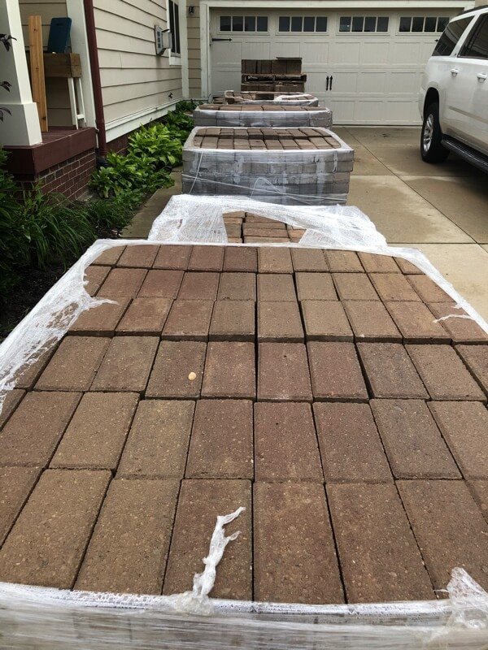
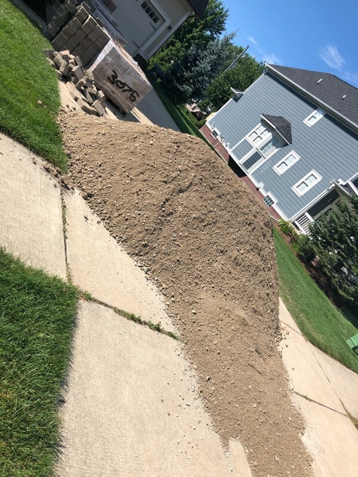
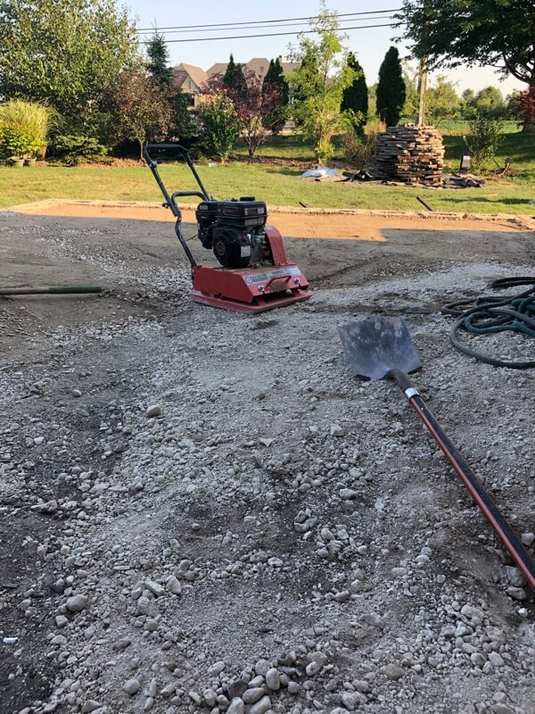
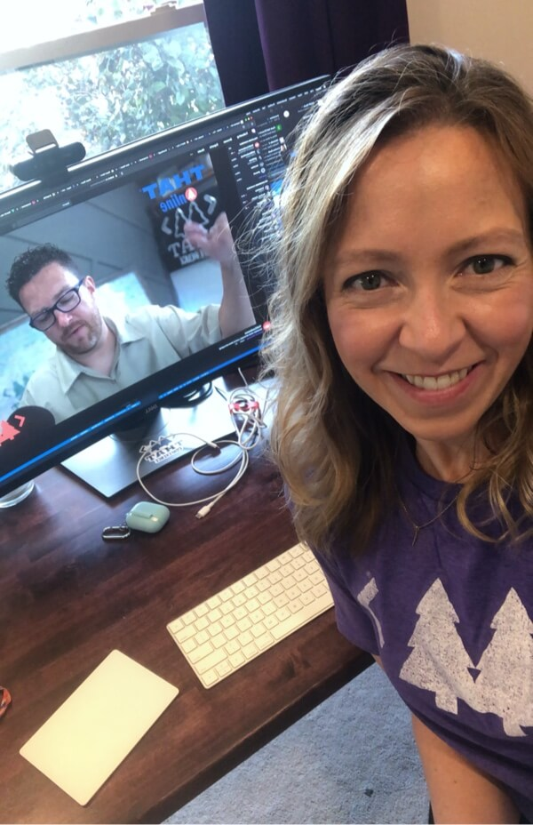

### Fitness Week

Some months my Apple Activity gives me a break, like some magical programmer baked into some logic that said, "This person has been going pretty hard, let's give 'em a lay up month." Either that programmer has moved on, they fixed the "bug", I'm not sure but my monthly challenges continue to push harder each month. I know, it's a challenge. It would be cool if I could pick... beginning on the month it gives me even 2 options. At any rate, my August challenge... burn 35,700 calories.
 
 
I still can't decide if I want to go for it or not, so I've tried to burn the average calories per day so future Sara can figure that out.
 
 
 

### Reading

#### Finished Reading

<a href="https://www.amazon.com/Daring-Greatly-Courage-Vulnerable-Transforms/dp/1592408419" target="_blank" rel="noopener">**"Daring Greatly" by Brene Brown**</a> 
Such a great book. All of Brene's books are so good. The last portion of the book she talked about Daring Greatly as a parent. It stuck with me. I really liked when she asked the reader to think about what the first words or looks they give their kids when they first see them. Is it, "Why are you wearing that?" or maybe, "What's wrong with your hair?" She talked about how those impressions impact a kid, and had you think about letting your first look and words to them reflect how you truly feel... smiles, love, happiness.
 
 
Hearing that is like buying a red car, and then it's all you can think about and see... all the red cars on the road. Now each time I see the kids at the beginning of the day I pause for a millisecond and reflect my love back at them, "Oh hiya there you handsome thing!" Life is busy, something always to do, always could be better but I want them to feel my love and happiness always!
 
 

#### Currently Reading

<a href="https://www.radicalcandor.com/" target="_blank" rel="noopener">**"Radical Candor" by Kim Scott**</a> Slowly continuing through this one. Not as much reading/walking time this week with all the house work, but still getting my fix in when I can.
 
 
 

### We were replacing 1 window!

Honestly I can't remember, did it start with wanting to replace a window, or was it simpler than that and me just wanting to paint my office.... no matter, scope has more than crept. I mean we are talking a full on explosion of scope here. So here we are, week unknown into home projects...
 
 
I mean I guess we are making good use of the time. Scott already had this and next week off for our annual THAT Conference - Wisconsin trip... plus it's too late to back out (I checked, they wouldn't pick the brick back up after delivery). I also think the guy delivering the crushed concrete thought I was trying to be funny when I told him I was "questioning life choices".
 
 

  
  
  

 
 
 

### Grateful For...

1. My lil Bug-sons heard me say a couple times how pretty the flowers growing around our house were, so he picked just the petals off and put them in a glass cup on my desk. Heart = full!

2. The vet giving us extra pills for Nash after he got neutered. Dog got a pill on a peanut butter cracker and would pass out. It was sooo nice! Boxers are great and all, but now I know why I said no the last 4 years to having 2.

3. My coated gardening gloves. Please see above... you see all those bricks. Life. Saver.

4. THAT Conference Community. This would have been our 6th year with that incredible group os people in Wisconsin Dells. The entire family is missing the trip badly. My good friend Clark Sell did an incredible job expressing how all of us were feeling... grief, hope, sadness, happiness... tears and all. I am grateful there was a virtual event on Monday to bring us together.

 
 
 
