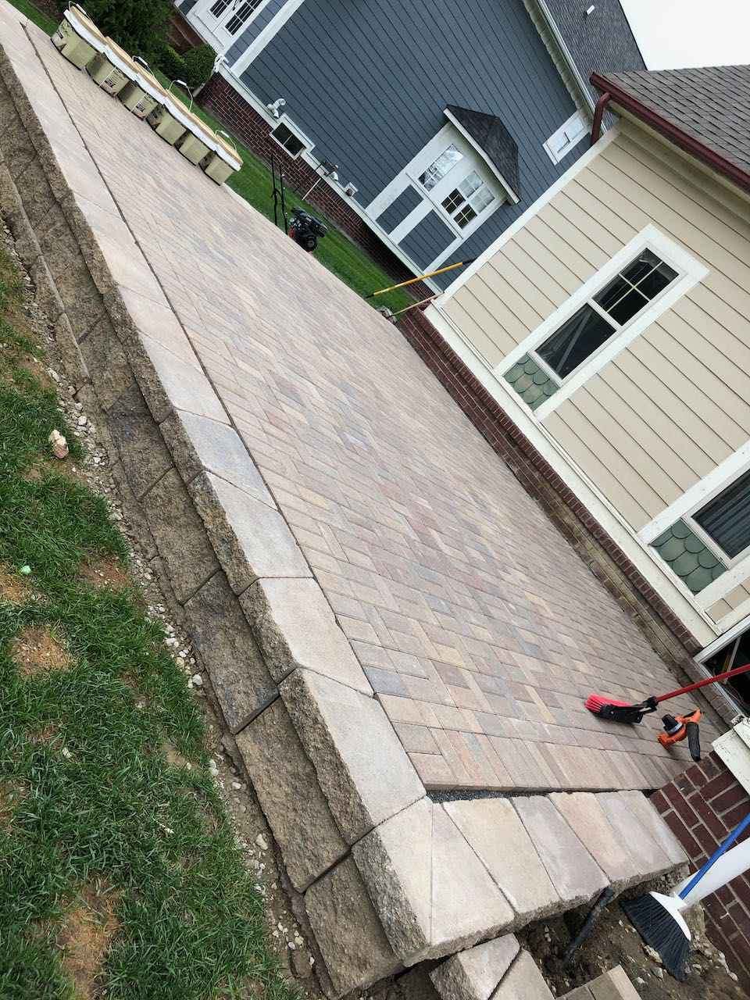

### Celebration

Saturday September 5th we were blessed to see 2 of the most incredible people begin their life together. Not only was it a beautiful day, it was filled with laughter, we were with actual people face to face and the cake... omg, the cake 🤤
  
I love me a fun wedding, but the cake. Cause you know there is no messing around with a wedding cake. I'm talking layers, buttercream, filling happening... I'm not a sweets person, but a good wedding cake is where it's at. Ok, but back to the people...
 
 
We got to spend a night with people y'all! Hugs, drinks, stories, pictures. I didn't realize how much nto seeing and being with people was getting to me. Our karate family is so amazing. The owners of the dojo (who's wedding it was) are incredible, just such good people. I loved everything about this night. 

  <video height="325" controls autoplay>
    <source src="sunglasses.mov" type="video/mp4">
  </video>

 
Joe and Lexi, we love you two and are so blessed for all you do for our family and community! You are bring positive impact to all the lives you touch. Happiness always! ❤️

  
  
  

 
 
 

### Patio #2 Complete!!!

Alright, let's have some story time... when we first got our house I knew exactly the patio I wanted off the kitchen area. Scott told me "too much digging, try again". Years later we compromised (ok, I mostly won, but shh, just go with it). So we put plans together and were all set to play along with our HOA.
 
 

That's when it happened... Scott (most definitely him, not me at all) says, "If we are going to submit all this to HOA let's submit all we want to do including a patio out the back of the garage." Without 7 pallettes of bricks in your driveway this seems like a great idea. 
 
 
I have to admit the 2nd patio build process was less stressful. It staled a bit while I regained feeling in my hands, but once determination set in, it was go time. Actually, come to think about it... near each night we were working on the patio Scott would bring me a hard cider while I worked. And I continued to lay bricks until dark. Sneaky trickster was working me! 
 
 
Was a relief to get the last brick in place and sand put down. No, I will not be adding "builder of brick patio" as a LinkedIn skill. If you are inclined to endorse me, "General Awesomeness" is there for ya and clearly covers all areas. 🙃 

 
 
 

### Podcasts

You all know I love me some audio books, and I'm right in the middle of "Everything is F*cked", but I need a break from it. I admittedly lean to looks that are funny, inspiring, with a dash of lady power, so this one is a bit different. I really enjoy how it is bending my mind, but coming off Jen Hatmaker I was missing her and she hasn't gotten back to me yet about my friendship proposal. So, I jumped over to some podcasts this week. Here is what I was listening to:

<a href="https://podcasts.apple.com/us/podcast/160-health-is-not-punishment-building-you-you-want/id1245763628?i=1000489712146" target="_blank" rel="noopener">**Rachel Hollis Podcast** - 160: Health Is Not a Punishment! Building The YOU You Want with Jay Shetty</a> I love hearing Jay Shetty's story. You hear he was a monk, and assume he has always been this all knowing and wise person. But he had his struggles too, questioning "what is happiness" and working to find himself. He talks about how while in business school he heard a monk speak and thought out of all the successful business people he has heard speak, this monk was the one who had effortless happiness. Natural joy. Was just great to hear and thinking about what pieces of our life give us that natural happiness.  
 
 
<a href="https://jenhatmaker.com/podcast/series-26/glennon-doyle-on-whats-true-and-beautiful-and-the-lies-weve-been-told/" target="_blank" rel="noopener">**For The Love With Jen Hatmaker Podcast**- Glennon Doyle On What's True And Beautiful, And The Lies We've Been Told</a> This two together was magical! They had a great conversation about looking inward, not outward. How when people say things like "should", "the right thing", "shouldn't" they are cues to ask why. What is the right and wrong to our inner being and not what society has forced upon us. I just love that both these women dive deep into being your true self. This was a great conversation I put in my repeat category. 
 
 
<a href="https://jayshetty.me/podcast/lewis-howes-on-how-to-embrace-your-vulnerability-create-strong-relationships-live-a-full-authentic-life/" target="_blank" rel="noopener">**"Jay Shetty, On Purpose**- Lewis Howes, How To Embrace Your Vulnerability, Create Strong Relationships & Live A Full Authentic Life</a> Again, such amazing people in this world having a deep conversation about what we do to be our perfect selves. Why we do it and how it ruins us. Why do we wait for permission. Why do we wait for someone else to do or say something to make it ok for us to. Why can't we just be vulnerable and do what is true to us. Just powerful stuff continuing to push myself to be fully me and I love it!
 
 
 

### Grateful For...

1. Our karate family. Blessed to have landed in such an amazing group of people who love, support, encourage and teach myself and family continuously. 

2. Brooklynn having landed onto a first job that she really enjoys with great people, making new friends. It gives me warm fuzzies when a cashier says, "Brooklynn is your daughter! She is so sweet, such a good kid... I love working with her." Followed by the thought of, "whew, didn't mess that one up too badly"

   
3. Hudson's imagination. It is off the charts lately. Regardless if he is fully embracing being 6 or the quarantine has gotten to him, I continue to fully embrace! Well except for the time he wanted to use the rope he found to lasso and swing from the stairs... "Hey there my littlest fry, let's give mama that rope there."

