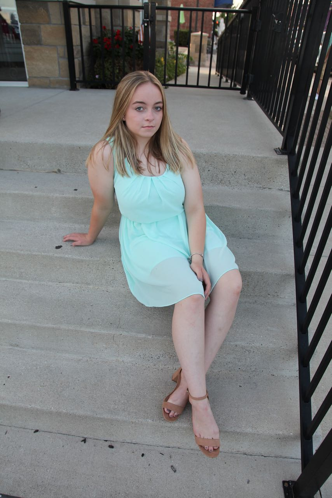

### School! School is happening!!

Alarm goes off, feet in the floor immediately as excitement is too high to snooze. I can hear the kids up in the house getting ready for the big day. I had stayed up the night before to make sure the felt board was ready for morning pictures. 
  
Squeeze the kids to spread some excitement. Grab some first day pics. Run through the checklist... do you have your schedule, water bottle, lunch, mask... all checked and ready to roll. Then there it is. The sound of the school bus pulling into our subdivision. It was magical. After a couple minutes as it circle the sub for other pick ups, here it it. Lights flash, door open... omg, it's happening! And then off they go. 
  
This has been the longest, weirdest summer break ever in the history of schooling. I am SO glad to see it start back up. The kids need the routine, schedule, someone they will listen to when they said "read a book"... all of it. Not to mention the parents out there who haven't had the quiet house during school days, the struggle is real and I feel ya. We are in this together.
 
 
For now, B and Hunter are going to in person school. Chase and Hudson are virtual. All working together to make the best lemonade we can. 
 

  
  
  
  

 
 
 

### Breaking Bread

I had a goal to get the patios done before Scott went back to work. Yeah, I don't know what I was thinking either. Then it turned into before the kids went back to school. So I set a date, named and declared it, Sat. Sept. 12th - "End of Summer Celebration". No matter what I was going to make it happen. 
  
Ok, so we will need outdoor furniture. This is also what everyone else thought back in May, June, July and August. There was 0 to be had. None I could order to get here on time, or anytime before we risked snow flurries. So we made do with what we had. Got our movie projector, planned some eats and fetched all the tables and chairs from the camper. It was time to break bread (translation, spill ketchup and lemonade) on the new patio. 
  
The weather was amazing. The summer eats, delish. Beverages. Friends. Even the folding furniture, it was the absolute perfect way for us to break in the new patio. 
  

 
 
 

### Reads
#### Finished Reading

<a href="https://markmanson.net/books/everything-is-fucked" target="_blank" rel="noopener">**"Everything Is F*cked: A Book about Hope" by Mark Manson**</a> I got to be honest I enjoyed this book cause it made think deeply about the world we live in. How people think and act. But it was also difficult for me. For some things it is easier to keep blinders on and not think. But everything is a religion working to get people to buy in, to believe. 
 
 
I liked though how he ended. To not hope, but **be**. Don't hope for better. **Be** better.
 
 
Parts of this book made me really reflect back on difficult relationships or situations in my life. Times when the person or situation made me feel in the wrong... that I messed up, not good enough. But that is not true. I am enough. I didn't mess up. I didn't mis-hear or understand. I am a smart woman. A free thinker. Working to do better, and be better everyday. 
 
 
 

### "Mom, I'm pretty much already a ninja"

Chase had his first karate class this week. Got a crisp new Gi to wear and off to class learning all the cool "ninja" moves. At the end of class Sensei gave Chase his white belt. 
 
 
He was so pumped, came right into the house to show me. "Mom! I got my white belt on my first class! Hunter didn't get his white belt on his first class. I'm going to be a black belt way before Hunter. I mean, I'm already stronger than him." 🥋
 
 
Come to find out he barely spoke in class, despite having a great time. We later found out he did though get Semapi's ear for a bit... long enough to tell her the same, "I'm going to be a higher belt than Hunter." He is going to love this! And hopefully stop parkouring all over the house. 

 
 
 

### More Senior Pics 📷

Grabbed a day after B got out of work, weather was gorgeous and went exploring in New Baltimore to take some more senior pics. Was so much fun! One of B's friends joined so I could take senior pics for her as well, and we just had such a great time with it all.
 
 
I also love playing photographer. I mean I was looking through Pinterest boards continuously while were out there for pose ideas, but I looked legit. I still need to go through all of them and figure out how in the world to edit but here is a preview...

 

  
  
  

 
 
 

### Grateful For...

1. B's friend for letting me take her senior pics. I can't wait to get out there again with ya! 

2. Friends who impromptu joined us for bread breaking on our patio. And for willingness to come up with our own mixed drink recipes with hard ciders. Those were so yummy, but next time let's not let Scott pour the tequilla. 😉

3. Teachers. I know it's not an easy path for you this year. Grateful for all you do to keep our kids going to school in whatever ways you can. 👩‍🏫
   
4. Tylenol. Please refer to second grateful above. 

