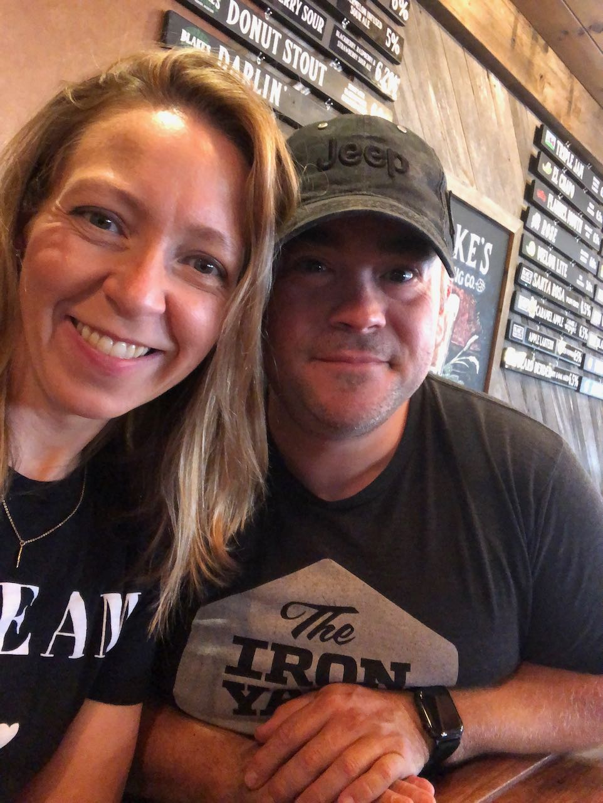
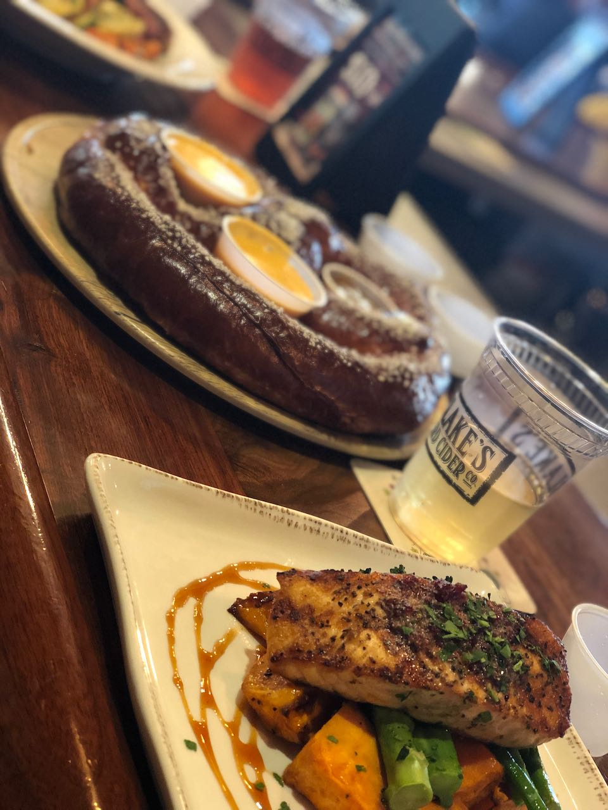

### Fitness Journey - The Forgotten Muscles

For months I've been so focused on walking, exercising, working on the house projects. These past couple weeks I've been cutting myself some slack. There has been a bunch going on with getting back to school, wrapping up patio and me getting settled in new job. So this week has been lots of walks, some outside, some late nights on the treadmill and mixed in a couple <a href="https://www.chloeting.com/" rel="noopener">Chloe Ting</a> workouts. 
  
FOund out she had a new workout challenge for the summer, <a href="https://www.chloeting.com/program/2020/two-weeks-shred-challenge.html" rel="noopener">2020 2 Weeks Shred Challenge</a>. I did the first day... yup pretty sore. Pushed myself the next day to do day 2
 
 
 

### How To Slay Virtual Schooling

Yeah, I have no idea how to "slay virtual school". Is that even a thing that is possible? To all you virtual schooling, now teaching, parents out there... we're going to define what it means to "slay virtual school" right now...
 
 
On school days, you wake up your little humans, get the virtual meetings working before they end, feed your lil humans and manage to get yourself a shower. Done. Winning. Get the Google Classroom assignments done, awesome... got your tiny human to read, whoop whoop... it's all gravy. 
 
 
We're in this together. No comparing to each other. No feeling bad if you don't make fresh waffles each morning, forget an assignment, or don't have a list of special arts and crafts or science projects to fill in each day. Hey, I work in tech and couldn't get Zoom working for 20 mins this week. We are in uncharted territory here people and need to work together to find our way. 
 
 
To start us off here is the few things helping me so far...
 
 
🏷 Teach your wee one the beauty of the bookmark bar in the browser. Clear out whatever is there, then add links to each site they need for school. It will display the icon and you can enter whatever text you want to display. Then they can easily to all the sites being fired at you.
 
 
🔗 If your teacher uses the same Zoom (or whatever meeting) link for each lesson, add it to the bookmark bar. Hudson's teacher gave a link that has all the codes to launch the meeting, no typing. I tell him now, "Zoomie time" and he knows exactly what to do. Opens the browser, clicks the zoom icon in the bookmark bar.
 
 
✏️ Don't buy 10 pencils, buy at least 100. Yup, that is what I did. I don't want to hear "I can't find a glue stick", nope I got <a href="https://www.amazon.com/Elmers-Disappearing-Purple-Washable-0-24-ounce/dp/B000VXO4L2/ref=sr_1_4?dchild=1&keywords=glue+sticks&qid=1601427719&s=office-products&sr=1-4" rel="noopener">a box of 30</a> up in here. <a href="https://www.amazon.com/AmazonBasics-Pre-sharpened-Wood-Cased-Pencils/dp/B071JM699P/ref=sxin_9_ac_d_sp?ac_md=0-0-null-ac_d_sp&cv_ct_cx=pencils&dchild=1&keywords=pencils&pd_rd_i=B071JM699P&pd_rd_r=bbeefd72-58bc-4673-9ab2-299e2f71fcf1&pd_rd_w=YpB80&pd_rd_wg=61rmG&pf_rd_p=3d1a8341-be16-45b1-ae3d-ba8c533ec9f0&pf_rd_r=CA1WGSZ1ZZAGCC7P6ANA&psc=1&qid=1601427780&s=office-products&sr=1-1-12d4272d-8adb-4121-8624-135149aa9081" rel="noopener">150 pencils</a>. No "I can't find the thing Mom." No excuses. Have a seat and get to it lil one. 
 
 
🖍 Washable markers. Wash-able. Your welcome. 
 
 
 

### Grateful For...

1. Ms. Maiya. She was part of the teaching staff for Chase and Hudson's preschool classes, who has become a wonderful friend to our family. Now comes over each school day to work with the boys. She is amazing with them, and the boys love her. Grateful. Blessing. I feel like I need to order her gifts each day she comes over.

2. This amazing fall weather. The fresh air, walks at day or night, just so wonderful. 
    
3. Getting out for a date lunch. Our first dine-in meal since March 8th (yes, I remember the exact date and restaurant). First date night/lunch since February. I barely knew what to do... "A drink menu? Ok, yes I would like to see what that is. Is there something that lists the food items you are serving?" It was lovely.

  
  

