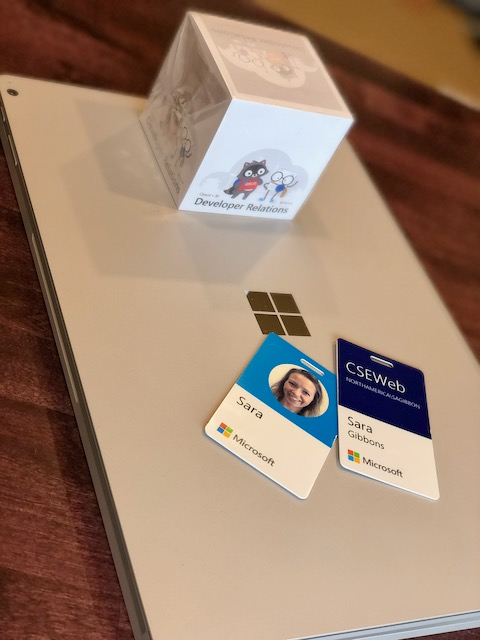

### Breaking Up With Apple Activity Goals
#### For now... we both know I'll be at 'em again (I can't resist)

Welp, I thought I was on target to hit my August Apple Activity goal of burning 35,700 calories. I did bath math and realized on Monday (8/31) I would have to burn 2000 calories to hit the goal. I could have hustled to hit it, but would it be worth it? Nahh. I opted to enjoy the day without watching checking numbers all day.
 
 
It was all a great intro for me in September. I think my goal from Apple Activity this month is 57 mins of exercise each day. Thanks but no. Listen, I love a challenge but you know what else I love dance parties. Why can't that be a goal, "Hey Grrll, let's mix it up and have some fun. Dance Party 10 times this month for your September goal." Hell to the yess I'd be in on that. 
 
 
So this month, no big goals. Fill the rings, mourn the end of summer and early morning sunny walks and get back to mid-afternoon walks to break up the 3pm sleepies. 
 
 
 

### Fitness Journey

I love my general doctor! Each time I see her I want to say, "So when are we meeting for coffee? walking together? starting a book club? whateves future friend, you pick." She is just good good people. 
 
 
I've been seeing her for years. She has seen me at my unhealthiest and now my healthiest. I try to stay on my well visit schedule, cause no way I'm giving the kids any ammo to not go to theirs. I make the appts for all of us, and we all go. No matter what. Nice try there wee ones, pandemic be damned, I'm a mom who made dentist appointments 6 months ago, saddle up, we out. 
 
 
My yearly checkup appointment I made back in early March. Was the earliest appt (crazy!). She walked in the room, said hi and interrupted me to look at her computer again, "I'm sorry, I had to double check the your name again. You look SO incredible! Tell me everything!" We spent a majority time of talking, sharing books and podcasts. She told me to own my journey. Get loud about it. How she wishes I could talk to so many of her patients, then told me to go get on some podcasts to be interviewed. Me! Interviewed!
 
 
She ended by telling she was giving health challenges to all her patients this year. Her challenge for me, meditate 5-10 mins each day. Me: "please to have exchange for different challenge?" She said no. I've know this was something I should be doing, guess this was the kick I need to start... tomorrow, I promise I'll start tomorrow. 
 
 
Now that I think about it I wonder if an acceptable 5-10 mins of meditation would include a tasty adult beverage, behind a locked door and yelling to the kids that I'm in timeout. 
 
 
 

### Evolving

This week I started my new job. Not a move I was looking for, or thought I would ever be presented with. But, we all evolve. People, companies, organizations. Some purposefully, some just life and circumstances. I'm working hard daily on being a better me than yesterday. Across all levels. Evolving faster than I ever have. Prouder and more confident of myself than ever. I wish the younger me knew how good this felt, but so extremely grateful the me today can feel it.
 
 
All bringing me to where I am now, starting off a new chapter of my career at Microsoft. Working on a fun project, with a great team, and endless opportunity ahead. I look forward to continuing to evolve there. Pushing myself to learn and do more. Excited to start down this path and can't wait to see where it leads me!

 
 
 

#### Currently Reading

<a href="https://markmanson.net/books/everything-is-fucked" target="_blank" rel="noopener">**"Everything Is F*cked: A Book about Hope" by Mark Manson**</a> This was a recommendation from a friend that I bumped to the front of the list. It is different then my streak I've been on but also slightly similar. I also say my alternate career would have been a therapist. I've always enjoyed trying to figure people out. Why they do what they do. This book needs that head on.
 
 
He dives right into hope and how it is what keeps up going. Why we do they things we do. Make the choices we do. It makes me think a lot about situations I've been through. Being a minority in tech. I am absolutely enjoying how it is bending my mind and have had a hard time putting it down.
 
 
 

### Happy Birthday Chasey-Pies! 🎂🎁🎈

My #3 is officially 8! We let him pick the day he wanted. Except the traditional playing across all Alexas, "Happy Birthday" by Stevie Wonder. Followed by the beginning on "In Da Club" by 50 Cent. There is singing and dancing, it's a whole thing that I make all the children endure. 

  
  

 
 
 

### Grateful For...

1. Warm welcome from my team and organization as I started my new job. 

2. Can I be grateful for fresh Michigan summer tomatoes again? Uhh, absolutely yes!! I keep a constant stream on my counter and will enjoy them daily while I still can.  

3. My Mom's crochet that I packed up right after she passed away. It all still has her smell. I hint of the detergent she liked, soap she used, maybe a touch of perfume or her makeup. It is magical. I had all the kids close their eyes an smell. They each said, "Nana ❤️"

4. My doctor. Just amazeballs. 
 
 
 